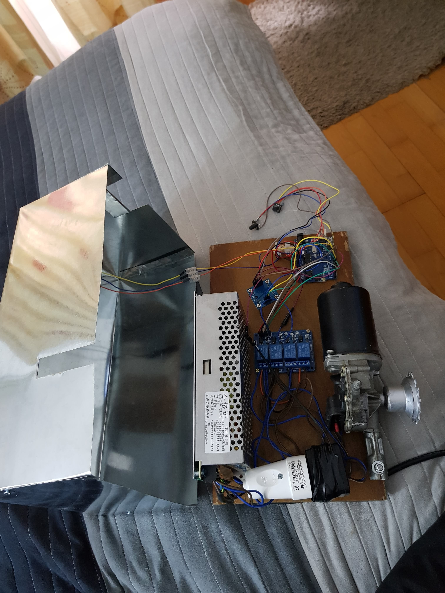

# GateOpeningUnit
Ad-hoc project with the scope of learning the basisc of robotics while doing something practical.

It uses a windshield-wiper motor from a car, and is capable of opening a gate that weighs up to 300kg.

The opening can be controled with a remote control or via mobile phone, by calling the number asigned to the gsm module.

By using a gsm module for controlling the gate, we can basycally control the unit from anywhere in the world.

Used components:
* 12v 260w power source for the motor and arduino board.
* 5v power source for the relays.
* 4 channel 5v relay
* 1 infrared sensor
* 1 SIM800L gsm module  

### Unit with case on :

### Unit with case off :

	
 
